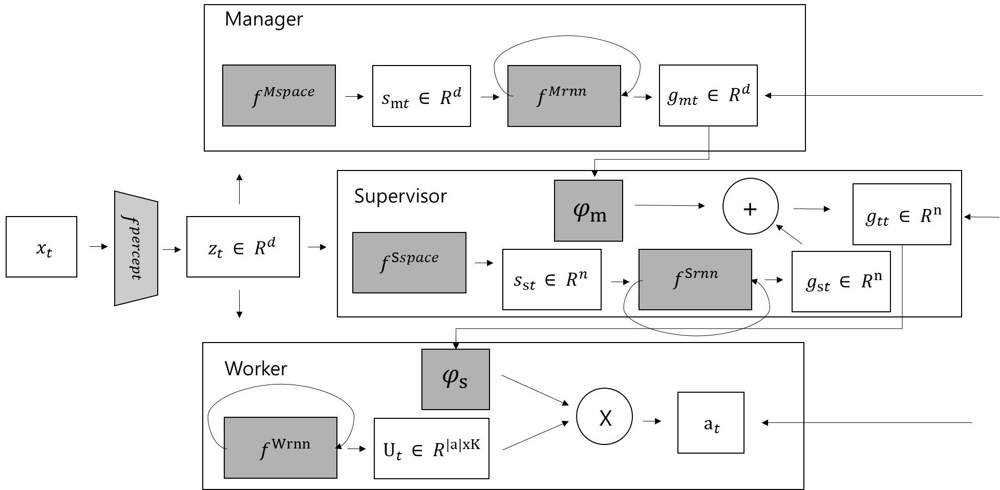

## 몇가지 수정해보기

MetlingPot 기본 아이디어 이미지

basic idea

- Original 

`metlingpotnet.py`
`metlingpotnet_main_mac.py`

- Modified by Dongjae (1)

`metlingpotnet_self.py`
`metlingpotnet_self_main.py`

자기자신의 state가 변하는 것에 대해서 배우는 걸로 한거, 즉 원래 feudal 처럼한거

- Modified by Dongjae (2)

- Modified by Dongjae (3) softmax 